# Diagrammes Schéma V2

Ce document rassemble les principaux diagrammes destinés au rapport TFE :
MCD (modèle conceptuel), MLD (modèle logique) et un diagramme de classes UML
basé sur le schéma v2 (`backend/app/db_v2`).

> Astuce : si ton markdown viewer ne rend pas Mermaid/PlantUML, copie la
> section dans https://mermaid.live/ ou https://www.planttext.com/ pour
> l’aperçu.

---

## 1. Modèle Conceptuel de Données (MCD)

```mermaid
erDiagram
    ORGANIZATION ||--o{ WORKSPACE : "contient"
    ORGANIZATION ||--o{ ORGANIZATION_MEMBERSHIP : "a des membres"
    ORGANIZATION ||--o{ AUDIT_LOG : "journalise"
    ORGANIZATION ||--o{ BOT_AGENT : "expose"
    ORGANIZATION ||--o{ WEBHOOK_ENDPOINT : "notifie"
    ORGANIZATION ||--o{ PRIVACY_REQUEST : "traite"
    ORGANIZATION ||--o{ CONVERSATION : "héberge"

    WORKSPACE ||--o{ WORKSPACE_MEMBERSHIP : "associe"
    ORGANIZATION_MEMBERSHIP ||--o{ WORKSPACE_MEMBERSHIP : "accède à"
    ORGANIZATION_MEMBERSHIP ||--o{ CONTACT_LINK : "gère"

    USER_ACCOUNT ||--|| USER_PROFILE : "possède"
    USER_ACCOUNT ||--|| USER_SECURITY_STATE : "a"
    USER_ACCOUNT ||--o{ DEVICE : "enregistre"
    USER_ACCOUNT ||--o{ SESSION_TOKEN : "s'authentifie"
    USER_ACCOUNT ||--o{ REFRESH_TOKEN : "renouvelle"
    USER_ACCOUNT ||--o{ EMAIL_CONFIRMATION_TOKEN : "confirme"
    USER_ACCOUNT ||--o{ PASSWORD_RESET_TOKEN : "réinitialise"
    USER_ACCOUNT ||--|| TOTP_SECRET : "MFA"
    USER_ACCOUNT ||--o{ NOTIFICATION_PREFERENCE : "paramètre"
    USER_ACCOUNT ||--o{ PRIVACY_REQUEST : "soumet"
    USER_ACCOUNT ||--o{ AUDIT_LOG : "déclenche"
    USER_ACCOUNT ||--o{ CONVERSATION_MEMBER : "participe"
    USER_ACCOUNT ||--o{ MESSAGE : "auteur"
    USER_ACCOUNT ||--o{ ORGANIZATION_MEMBERSHIP : "appartient"
    USER_ACCOUNT ||--o{ CONTACT_LINK : "a pour contact"
    USER_ACCOUNT ||--o{ CONTACT_INVITATION : "invite"

    DEVICE ||--o{ PUSH_SUBSCRIPTION : "notifie"
    DEVICE ||--o{ SESSION_TOKEN : "supporte"

    CONVERSATION ||--o{ CONVERSATION_MEMBER : "compte"
    CONVERSATION ||--o{ CONVERSATION_ENCRYPTION_KEY : "rotations"
    CONVERSATION ||--o{ CONVERSATION_INVITE : "invite"
    CONVERSATION ||--o{ MESSAGE : "stocke"
    CONVERSATION ||--o{ CALL_SESSION : "appels"
    CONVERSATION_ENCRYPTION_KEY ||--o{ MEMBER_KEY_WRAP : "clé chiffrée"
    CONVERSATION_MEMBER ||--o{ MEMBER_KEY_WRAP : "détient"
    CONVERSATION_MEMBER ||--o{ MESSAGE_DELIVERY : "reçoit"
    CONVERSATION_MEMBER ||--o{ MESSAGE_REACTION : "réagit"
    CONVERSATION_MEMBER ||--o{ MESSAGE_PIN : "met en avant"

    MESSAGE ||--o{ MESSAGE_ATTACHMENT : "contient"
    MESSAGE ||--o{ MESSAGE_DELIVERY : "livraison"
    MESSAGE ||--o{ MESSAGE_REACTION : "réactions"
    MESSAGE ||--o{ MESSAGE_PIN : "est épinglé"

    CALL_SESSION ||--o{ CALL_PARTICIPANT : "participe"
    CONVERSATION_MEMBER ||--o{ CALL_PARTICIPANT : "rejoint"
```

---

## 2. Modèle Logique de Données (MLD)

| Table | Clé(s) | Colonnes essentielles | Remarques |
|-------|--------|-----------------------|-----------|
| organizations | `id` (UUID) | name, slug (unique), settings JSONB, retention_days | Découpage multi-tenant |
| organization_memberships | `id` (UUID) | organization_id, user_id, role (enum), joined_at | Contrainte unique (org, user) |
| workspaces | `id` | organization_id, slug (unique), description | Vue logique par équipe/projet |
| workspace_memberships | `id` | workspace_id, membership_id, joined_at | Lien membre ↔ workspace |
| user_accounts | `id` | email (unique), hashed_password, role, is_active, lock info | Données d’authentification |
| user_profiles | `user_id` (PK/FK) | display_name, avatar_url, locale, profile_data JSONB | Séparation profil ↔ credentials |
| user_security_states | `user_id` (PK/FK) | totp_enabled, recovery_codes JSONB, lock MFA | Posture MFA / protection |
| devices | `id` | user_id, fingerprint (unique par user), public_key, device_metadata JSONB | Gestion appareils de confiance |
| session_tokens | `id` | user_id, device_id, access_token_jti, refresh_token_jti, ip | Sessions actives |
| refresh_tokens | `token_jti` | user_id, session_id, expires_at, revoked_at | Contrôle de session longue durée |
| email_confirmation_tokens | `id` | user_id, token (unique), expires_at, consumed_at | Confirmation de compte |
| password_reset_tokens | `id` | user_id, token (unique), expires_at, used_at | Reset mot de passe |
| totp_secrets | `user_id` | secret, confirmed_at | MFA TOTP |
| contact_links | `id` | owner_id, contact_id, status enum, alias | Contrainte unique (owner, contact) |
| contact_invitations | `id` | inviter_id, email, token (unique), expires_at | Invitations externes |
| conversations | `id` | organization_id, workspace_id, type enum, encryption flags, extra_metadata | Canal de discussion |
| conversation_members | `id` | conversation_id, user_id, role enum, state enum, last_read | Unique (conversation, user) |
| conversation_encryption_keys | `id` | conversation_id, generation, encrypted_key, key_algo | Rotations de clé maître |
| member_key_wraps | `id` | conversation_key_id, member_id, encrypted_key | Clés wrap par membre |
| conversation_invites | `id` | conversation_id, email, token (unique), role, expires_at | Liens d’invitation |
| messages | `id` | conversation_id, author_id, type enum, stream_position (unique par conv), ciphertext, encryption_metadata JSONB | Stockage chiffré |
| message_deliveries | `id` | message_id, member_id, state enum, delivered/read timestamps | Accusés réception |
| message_attachments | `id` | message_id, storage_url, encryption_info JSONB | Métadata fichiers, empreinte |
| message_reactions | `id` | message_id, member_id, emoji | Unique (message, membre, emoji) |
| message_pins | `id` | conversation_id, message_id, pinned_by | Gestion des messages épinglés |
| call_sessions | `id` | conversation_id, call_type, room_name, timestamps | Sessions audio/vidéo |
| call_participants | `id` | call_id, member_id, device_id, metrics JSONB | Qualité/participation |
| notification_preferences | `id` | user_id, channel enum, is_enabled, quiet_hours JSONB | Périmètre alertes |
| outbound_notifications | `id` | organization_id, user_id, channel enum, payload JSONB, status | File d’attente notifications |
| push_subscriptions | `id` | device_id, channel enum, endpoint (unique pair device/endpoint) | WebPush/mobile |
| webhook_endpoints | `id` | organization_id, url (unique par org), secret, events JSONB | Intégrations externes |
| bot_agents | `id` | organization_id, token (unique), scopes JSONB | Automatisation interne |
| audit_logs | `id` | organization_id, user_id, action, resource & details JSONB | Traçabilité |
| privacy_requests | `id` | organization_id, user_id, type enum, status enum, notes | RGPD/Gestion droits |

> Chaque table JSONB est définie avec `postgresql.JSONB(astext_type=sa.Text())`
> dans la migration, ce qui permet la recherche textuelle Full Text si
> nécessaire.

---

## 3. Diagramme UML (Vue classes/relations)

```plantuml
@startuml
skinparam monochrome true
skinparam classAttributeIconSize 0

class Organization {
  +id: UUID
  +name: str
  +slug: str
  +settings: JSONB
  +retention_days: int?
}

class OrganizationMembership {
  +id: UUID
  +role: OrganizationRole
  +joined_at: datetime
}

class Workspace {
  +id: UUID
  +name: str
  +slug: str
}

class UserAccount {
  +id: UUID
  +email: str
  +hashed_password: str
  +role: UserRole
  +is_active: bool
  +is_confirmed: bool
}

class UserProfile {
  +display_name: str?
  +avatar_url: str?
  +profile_data: JSONB?
}

class UserSecurityState {
  +totp_enabled: bool
  +recovery_codes: JSONB?
}

class Device {
  +id: UUID
  +fingerprint: str?
  +platform: str?
  +device_metadata: JSONB?
}

class SessionToken {
  +id: UUID
  +access_token_jti: str?
  +refresh_token_jti: str?
  +last_activity_at: datetime?
}

class Conversation {
  +id: UUID
  +type: ConversationType
  +slow_mode_seconds: int
  +extra_metadata: JSONB?
}

class ConversationMember {
  +id: UUID
  +role: ConversationMemberRole
  +state: MembershipState
  +muted_until: datetime?
}

class ConversationEncryptionKey {
  +id: UUID
  +generation: int
  +encrypted_key: bytes
  +key_algo: str
}

class MemberKeyWrap {
  +id: UUID
  +encrypted_key: bytes
  +wrapped_with: str
}

class Message {
  +id: UUID
  +type: MessageType
  +stream_position: int
  +ciphertext: bytes
  +encryption_metadata: JSONB?
}

class MessageDelivery {
  +id: UUID
  +state: MessageDeliveryState
  +delivered_at: datetime?
  +read_at: datetime?
}

class MessageAttachment {
  +id: UUID
  +storage_url: str
  +encryption_info: JSONB?
}

class MessageReaction {
  +id: UUID
  +emoji: str
}

class MessagePin {
  +id: UUID
  +pinned_at: datetime
}

class CallSession {
  +id: UUID
  +call_type: CallType
  +call_metadata: JSONB?
}

class CallParticipant {
  +id: UUID
  +joined_at: datetime
  +metrics: JSONB?
}

class NotificationPreference {
  +id: UUID
  +channel: NotificationChannel
  +is_enabled: bool
}

class OutboundNotification {
  +id: UUID
  +channel: NotificationChannel
  +payload: JSONB
  +status: str
}

class WebhookEndpoint {
  +id: UUID
  +url: str
  +events: JSONB
}

class BotAgent {
  +id: UUID
  +token: str
  +scopes: JSONB
}

class AuditLog {
  +id: UUID
  +action: str
  +resource_type: str?
  +details: JSONB?
}

class PrivacyRequest {
  +id: UUID
  +request_type: PrivacyRequestType
  +status: PrivacyRequestStatus
  +notes: str?
}

Organization "1" -- "0..*" Workspace
Organization "1" -- "0..*" OrganizationMembership
Organization "1" -- "0..*" Conversation
Organization "1" -- "0..*" AuditLog
Organization "1" -- "0..*" WebhookEndpoint
Organization "1" -- "0..*" BotAgent
Organization "1" -- "0..*" PrivacyRequest

OrganizationMembership "1" -- "0..*" WorkspaceMembership
OrganizationMembership "1" -- "0..*" ContactLink
OrganizationMembership "1" -- "0..*" ConversationMember

Workspace "1" -- "0..*" Conversation
Workspace "1" -- "0..*" WorkspaceMembership

UserAccount "1" -- "1" UserProfile
UserAccount "1" -- "1" UserSecurityState
UserAccount "1" -- "0..*" Device
UserAccount "1" -- "0..*" SessionToken
UserAccount "1" -- "0..*" ConversationMember
UserAccount "1" -- "0..*" Message
UserAccount "1" -- "0..*" NotificationPreference
UserAccount "1" -- "0..*" AuditLog
UserAccount "1" -- "0..*" PrivacyRequest
UserAccount "1" -- "0..*" OrganizationMembership

Device "1" -- "0..*" SessionToken
Device "1" -- "0..*" PushSubscription

Conversation "1" -- "0..*" ConversationMember
Conversation "1" -- "0..*" ConversationEncryptionKey
Conversation "1" -- "0..*" ConversationInvite
Conversation "1" -- "0..*" Message
Conversation "1" -- "0..*" CallSession

ConversationEncryptionKey "1" -- "0..*" MemberKeyWrap
ConversationMember "1" -- "0..*" MemberKeyWrap

ConversationMember "1" -- "0..*" MessageDelivery
ConversationMember "1" -- "0..*" MessageReaction
ConversationMember "1" -- "0..*" MessagePin

Message "1" -- "0..*" MessageDelivery
Message "1" -- "0..*" MessageAttachment
Message "1" -- "0..*" MessageReaction
Message "1" -- "0..*" MessagePin
Message "1" -- "0..*" CallParticipant

CallSession "1" -- "0..*" CallParticipant

@enduml
```

---

## 4. Lecture rapide pour le rapport

- **MCD** : montre les entités métier et leurs cardinalités (multi-tenant,
  conversations E2EE, gestion appareils/sessions, etc.).
- **MLD** : détaille les clés et colonnes critiques pour implémenter la base
  Postgres (enums, JSONB, contraintes uniques).
- **UML** : offre une lecture “objet/service” utile pour relier les modèles
  SQLAlchemy ou les services applicatifs à la structure SQL.

Tu peux importer ces diagrammes dans ton rapport TFE (fichiers Mermaid/PlantUML
ou versions rendues en PNG via les outils en ligne).
